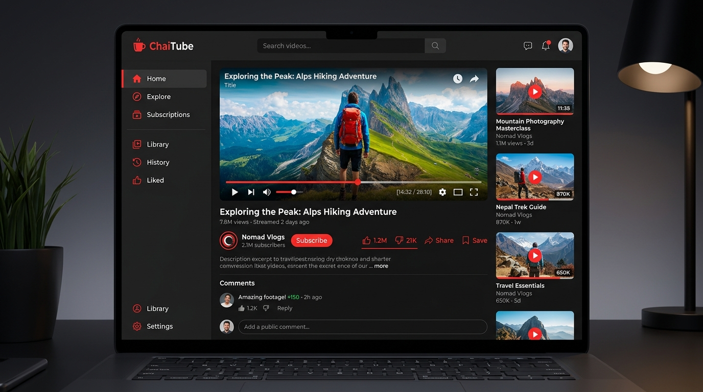
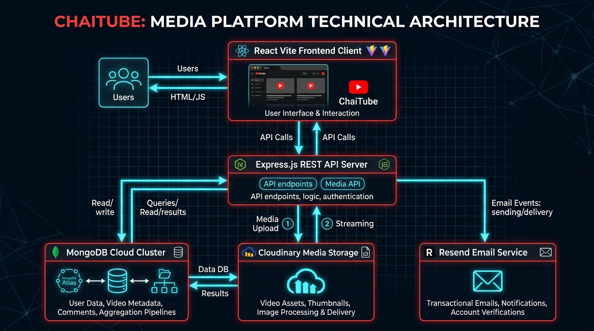

# 🎥 ChaiTube - Professional YouTube-Like Fullstack Platform



<p align="center">
  
  
  
  
  
  
  
  
</p>

---

## 🌟 Overview

**ChaiTube** is an enterprise-grade, production-hardened video-sharing application and media platform built with clean architecture, high-performance database indexing, robust security headers, and an interactive UI component system.

> [!NOTE]
> ChaiTube features end-to-end video publishing, nested comment threads, like/dislike interactions, public/private playlists, email verification, password reset flows, full-text search, and real-time subscription feeds.

---

## 🏗️ System Architecture



> [!IMPORTANT]
> The system operates as a unified full-stack architecture: the **Express.js API** handles business logic, security middleware, and MongoDB queries, while serving the compiled **React Vite SPA** for client routes.

---

## 🔥 Core Feature Breakdown

### 🔐 1. Authentication & User Security
- **Dual JWT Flow**: Access Tokens + HTTP-only Refresh Tokens stored in secure cookies (`SameSite`, `HttpOnly`).
- **Email Verification**: Verification email pipeline via Resend API / Nodemailer.
- **Password Reset Flow**: Secure tokenized forgot-password and password reset workflow.
- **Sensitive Token Masking**: Mongoose projections exclude `refreshToken`, `emailVerificationToken`, and `forgotPasswordToken` from client payloads.

### 📹 2. Video Pipeline & Storage
- **Media Upload Pipeline**: Multer middleware with Cloudinary SDK integration for video files and thumbnails.
- **Publish Controls**: Instant public/private visibility toggles.
- **Watch History Tracking**: Automatically updates user watch history on video playback.
- **Cascading Purge**: Deleting a video automatically purges linked comments, likes, playlist entries, and watch history records.

### 👍 3. Social Interactions & Engagement
- **Likes & Dislikes**: Toggle likes on videos and comments with real-time aggregated counts.
- **Threaded Comment System**: Top-level video comments with paginated nested replies and owner moderation controls.
- **Playlists**: Custom public and private video playlists with instant add/remove actions.

### 🔎 4. Search & Subscriptions
- **ReDoS-Protected Search**: ReDoS-safe regular expression search across videos and channel profiles.
- **Channel Subscriptions**: Instant subscription toggling with subscriber counter aggregation.

---

## 🛠️ Technology Stack

| Layer | Technologies Used |
| :--- | :--- |
| **Backend Runtime** | Node.js (ES Modules `"type": "module"`) & Express 5 |
| **Database** | MongoDB & Mongoose ODM (Aggregation Pipelines & `mongoose-aggregate-paginate-v2`) |
| **Validation** | Zod Schema Validation & Sanitization Middleware |
| **Security** | Helmet Security Headers, Express Rate Limit, Mongo Sanitize, ReDoS Escaping |
| **Media & Mail** | Cloudinary SDK, Multer Upload, Resend API, Nodemailer |
| **Frontend UI** | React 19, Vite 8, React Router 7, Modern Dark Theme CSS |
| **Testing & Linting** | Jest 30 (`--experimental-vm-modules`), Supertest, Oxlint |

---

## 📂 Repository Structure

```text
├── docs/assets/             # Architecture diagrams and UI showcase mockups
├── public/temp/            # Temporary file upload staging
├── src/
│   ├── controller/         # User, Video, Like, Comment, Playlist, Subscription & Search logic
│   ├── db/                 # Database connection & index setup
│   ├── middleware/         # Auth (JWT), Rate Limiting, Zod Validation, Multer & Error Handling
│   ├── model/              # Mongoose database models (User, Video, Subscription, Like, Comment, Playlist)
│   ├── route/              # API routers (/users, /videos, /likes, /comments, /playlists, /search)
│   ├── schema/             # Zod validation schemas
│   ├── test/               # Automated unit & integration Jest test suites (39 tests)
│   ├── util/               # ApiError, ApiResponse, Cloudinary upload, Email service
│   ├── app.js              # Express app setup & SPA fallback routing
│   ├── constants.js        # Global app constants
│   └── index.js            # Entry point & graceful server shutdown bootstrap
├── frontend/               # React Vite client SPA
│   ├── src/api/client.js   # Unified API client bindings
│   ├── src/context/        # Auth & Toast context providers
│   └── src/hooks/          # Dedicated React custom hooks
├── .env.sample             # Environment configuration template
├── vercel.json             # Vercel deployment configuration
├── jest.config.js          # Jest ES Modules test runner config
└── package.json            # Scripts, project metadata & dependencies
```

---

## 📡 API Reference Cheat Sheet

### 1. Authentication & Account (`/api/v1/users`)
| Method | Endpoint | Description | Auth Required |
| :--- | :--- | :--- | :--- |
| `POST` | `/register` | Register account with avatar & cover image | No |
| `POST` | `/login` | Authenticate user & set secure cookies | No |
| `POST` | `/logout` | Invalidate session tokens & clear cookies | **Yes** |
| `POST` | `/refresh_token` | Issue new access token using refresh cookie | No |
| `POST` | `/verify-email` | Verify email address via token | No |
| `POST` | `/forgot-password` | Send password reset token email | No |
| `POST` | `/reset-password` | Reset password using reset token | No |
| `GET` | `/current-user` | Fetch authenticated user profile | **Yes** |
| `PATCH` | `/update-account` | Update account name & email | **Yes** |
| `PATCH` | `/avatar` | Update avatar image | **Yes** |
| `PATCH` | `/cover-image` | Update cover banner image | **Yes** |
| `GET` | `/c/:username` | Get public channel profile & stats | Optional |
| `GET` | `/history` | Get account watch history | **Yes** |

### 2. Video Operations (`/api/v1/videos`)
| Method | Endpoint | Description | Auth Required |
| :--- | :--- | :--- | :--- |
| `GET` | `/` | Paginated feed of public videos | No |
| `POST` | `/publish` | Upload video file & thumbnail | **Yes (Verified Email)** |
| `GET` | `/:videoId` | Get video details (owner view for unpublished) | Optional |
| `PATCH` | `/:videoId` | Update video title & description | **Yes** |
| `DELETE` | `/:videoId` | Delete video & purge all linked data | **Yes** |
| `PATCH` | `/toggle/publish/:videoId` | Toggle video public/private status | **Yes** |
| `POST` | `/view/:videoId` | Increment views & record watch history | Optional |
| `GET` | `/channel/:username` | Fetch channel's published videos | Optional |

### 3. Likes (`/api/v1/likes`)
| Method | Endpoint | Description | Auth Required |
| :--- | :--- | :--- | :--- |
| `POST` | `/toggle/v/:videoId` | Toggle like status on video | **Yes** |
| `POST` | `/toggle/c/:commentId` | Toggle like status on comment | **Yes** |
| `GET` | `/videos` | Fetch user's liked videos | **Yes** |

### 4. Comments & Replies (`/api/v1/comments`)
| Method | Endpoint | Description | Auth Required |
| :--- | :--- | :--- | :--- |
| `GET` | `/:videoId` | Fetch top-level comments with like/reply counts | Optional |
| `POST` | `/:videoId` | Add comment or nested reply | **Yes** |
| `GET` | `/c/:commentId/replies` | Fetch paginated nested replies | Optional |
| `PATCH` | `/c/:commentId` | Edit comment text | **Yes** |
| `DELETE` | `/c/:commentId` | Delete comment & child replies | **Yes** |

### 5. Playlists (`/api/v1/playlists`)
| Method | Endpoint | Description | Auth Required |
| :--- | :--- | :--- | :--- |
| `POST` | `/` | Create playlist | **Yes** |
| `GET` | `/user/:userId` | Fetch user playlists | Optional |
| `GET` | `/:playlistId` | Fetch playlist details & videos | Optional |
| `POST` | `/add/:playlistId/:videoId` | Add video to playlist | **Yes** |
| `DELETE` | `/remove/:playlistId/:videoId` | Remove video from playlist | **Yes** |
| `PATCH` | `/:playlistId` | Edit playlist title/privacy | **Yes** |
| `DELETE` | `/:playlistId` | Delete playlist | **Yes** |

### 6. Subscriptions, Search & System
| Method | Endpoint | Description | Auth Required |
| :--- | :--- | :--- | :--- |
| `POST` | `/api/v1/subscriptions/c/:channelId` | Toggle channel subscription | **Yes** |
| `GET` | `/api/v1/subscriptions` | Fetch subscribed channels feed | **Yes** |
| `GET` | `/api/v1/search?q=query` | Full-text search channels/videos | No |
| `GET` | `/api/v1/health` | Health status check | No |
| `GET` | `/api` | Root API documentation payload | No |

---

## ⚡ Quick Start & Deployment

### 1. Local Setup
```bash
# Clone the repository
git clone https://github.com/md-shaquib007/Media-storage-app.git
cd Media-storage-app

# Install backend & frontend dependencies
npm install
cd frontend && npm install && cd ..
```

### 2. Environment Variables (`.env`)
```env
PORT=8000
CORS_ORIGIN=http://localhost:5173
MONGODB_URI=mongodb+srv://<username>:<password>@cluster.mongodb.net/chaitube
ACCESS_TOKEN_SECRET=your_super_secret_access_token_key_here
ACCESS_TOKEN_EXPIRY=1d
REFRESH_TOKEN_SECRET=your_super_secret_refresh_token_key_here
REFRESH_TOKEN_EXPIRY=10d
CLOUDINARY_CLOUD_NAME=your_cloud_name
CLOUDINARY_API_KEY=your_api_key
CLOUDINARY_API_SECRET=your_api_secret
RESEND_API_KEY=your_resend_key
EMAIL_FROM=noreply@chaitube.com
```

### 3. Verification & Development Commands
```bash
# Run complete verification (39 Jest tests + Oxlint + Vite build)
npm run verify

# Start development backend
npm run dev

# Start development frontend
cd frontend && npm run dev
```

---

## 🧪 Testing Suite

Tests run in isolated Node.js ES Module VM environments.

```bash
npm test
```

> [!TIP]
> All 7 test suites (39 unit and integration tests) run in isolated memory contexts with zero side-effects.

---

## 📜 License & Acknowledgments

Built with ❤️ for high-performance media storage and video sharing workflows.